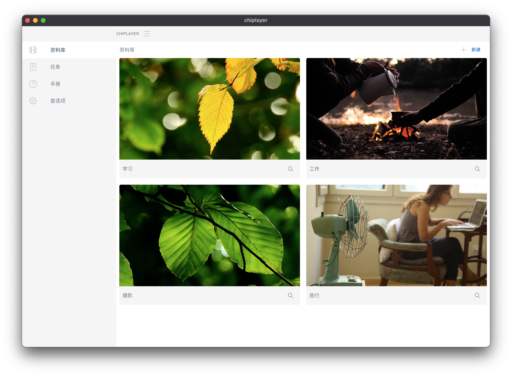

# chiplayer

chiplayer 是一款开源的本地视频管理工具，采用 electronjs react golang 等技术实现。




## 编译方法

请使用mac或linux系统进行编译

```shell
cd scripts/package
./build_all.sh
```

## 代码结构

chiplayer\
└── backend go语言编写的后台程序，react只是一个ui
└── frontend react写的ui
└── scripts 编译工具
└── window electron编写的窗口程序
